# Universidad Centroamericana José Simeón Cañas

`

# Ciclo 01/2023, Laboratorio: Entornos de desarrollo web con Docker.
### Catedrática: Elisa Aldana 
### 2023, Antiguo Cuscatlan 

## **¿Qué es Docker?**

`

Docker es una plataforma de software que permite crear, probar e implementar aplicaciones
rápidamente. Docker empaqueta software en unidades estandarizadas llamadas
contenedores que incluyen todo lo necesario para que el software se ejecute, incluidas
bibliotecas, herramientas de sistema, código y tiempo de ejecución. Con Docker, puede
implementar y ajustar la escala de aplicaciones rápidamente en cualquier entorno con la
certeza de saber que su código se ejecutará.

## **Conceptos básicos**
**Images**
Una imagen es una especie de plantilla, una captura del estado de un contenedor. Se
podría decir que una imagen de un contenedor es como un snapshot de una máquina
virtual, pero mucho mucho más ligero.
Por ejemplo una imagen podría contener un sistema operativo Ubuntu con un servidor
Apache y tu aplicación web instalada.
Las imágenes se utilizan para crear contenedores, y nunca cambian.
**DockerFile**
Es un archivo de configuración que se utiliza para crear imágenes. En dicho archivo se
indica qué es lo que queremos que tenga la imagen, y los distintos comandos para instalar
las herramientas.
**Containers**
Un contenedor de Docker es una instancia en ejecución de una imagen de Docker. Sin
embargo, a diferencia de la virtualización tradicional con un hipervisor de tipo 1 o tipo 2, un
contenedor de Docker se ejecuta en el núcleo del sistema operativo host.
**Volumes**
No es una buena práctica guardar los datos persistentes dentro de un contenedor de
Docker. Para eso están los volúmenes, fuera de los contenedores. Así se puede crear y
borrar contenedores sin preocuparse por que se borren los datos.
Además los volúmenes se utilizan para compartir datos entre contenedores.
**Links**
Sirven para enlazar contenedores entre sí, que están dentro de una misma máquina, sin
exponer a los contenedores cuáles son los datos de la máquina que los contiene.

## **¿Para qué se puede utilizar Docker?**
**Entrega rápida y consistente de sus aplicaciones.**
Docker agiliza el ciclo de vida del desarrollo permitiendo a los desarrolladores trabajar en
entornos estandarizados utilizando contenedores locales que proporcionan sus aplicaciones
y servicios.
**Escalabilidad**.
La plataforma basada en contenedores de Docker permite cargas de trabajo altamente
portátiles. Los contenedores Docker pueden ejecutarse en el portátil local de un
desarrollador, en máquinas físicas o virtuales en un centro de datos, en proveedores de la
nube o en una mezcla de entornos.
**Ejecución de más cargas de trabajo en el mismo hardware.**
Docker es ligero y rápido. Proporciona una alternativa viable y rentable a las máquinas
virtuales, de modo que puede utilizar más capacidad de cálculo para alcanzar sus objetivos
empresariales. Docker es perfecto para entornos de alta densidad y para implementaciones
pequeñas y medianas en las que se necesita hacer más con menos recursos.

## Comandos basicos de Docker

**sudo docker run**: este comando se utiliza para ejecutar un contenedor a partir de una imagen. Por ejemplo, docker run ubuntu ejecutará un contenedor basado en la imagen de Ubuntu.

**sudo docker ps**: este comando se utiliza para ver todos los contenedores en ejecución actualmente.

**sudo docker images**: este comando se utiliza para ver todas las imágenes de Docker disponibles en el sistema.

**sudo docker stop**: este comando se utiliza para detener un contenedor que se está ejecutando. Por ejemplo, docker stop my_container detendrá el contenedor llamado "my_container".

**sudo docker rm**: este comando se utiliza para eliminar un contenedor que ya no se necesita. Por ejemplo, docker rm my_container eliminará el contenedor llamado "my_container".

**sudo docker rmi**: este comando se utiliza para eliminar una imagen que ya no se necesita. Por ejemplo, docker rmi ubuntu eliminará la imagen de Ubuntu del sistema.

**sudo docker build**: este comando se utiliza para construir una imagen personalizada a partir de un archivo Dockerfile.

**sudo docker exec**: este comando se utiliza para ejecutar un comando dentro de un contenedor en ejecución. Por ejemplo, docker exec my_container ls -l ejecutará el comando "ls -l" dentro del contenedor llamado "my_container".

**sudo docker-compose**: este comando se utiliza para orquestar múltiples contenedores y sus dependencias en un entorno de aplicación más grande.

**sudo docker network**: este comando se utiliza para administrar redes Docker. Puede crear, eliminar y listar redes Docker utilizando este comando.

**sudo docker volume**: este comando se utiliza para administrar volúmenes Docker. Puede crear, eliminar y listar volúmenes Docker utilizando este comando.

**sudo docker logs**: este comando se utiliza para ver los registros de un contenedor. Puede ver los registros de un contenedor específico utilizando su ID o su nombre.

**sudo docker inspect**: este comando se utiliza para ver información detallada sobre un contenedor, imagen o red Docker. Puede utilizar este comando para ver información como la dirección IP de un contenedor o la configuración de red de una red Docker.

**sudo docker attach**: este comando se utiliza para conectarse a un contenedor en ejecución. Puede utilizar este comando para interactuar con el shell de un contenedor en ejecución o para ver los registros de un contenedor en tiempo real.

**sudo docker cp**: este comando se utiliza para copiar archivos entre el host y un contenedor Docker. Puede utilizar este comando para copiar archivos desde el host al contenedor o desde el contenedor al host.

**sudo docker export**: este comando se utiliza para exportar el sistema de archivos de un contenedor a un archivo tar. Puede utilizar este comando para crear una imagen personalizada a partir de un contenedor existente.

**sudo docker save**: este comando se utiliza para guardar una imagen Docker en un archivo tar. Puede utilizar este comando para guardar una imagen Docker localmente y transferirla a otro sistema Docker.

**sudo docker load**: este comando se utiliza para cargar una imagen Docker desde un archivo tar. Puede utilizar este comando para cargar una imagen Docker guardada previamente en otro sistema Docker.

# Ejercicio práctico/ Creación de la maquina virtual
### Creación de la máquina virtual

`

abrimos vm ware y damos click en crear nueva maquina virtual 

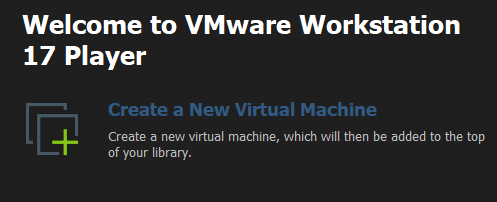

click en instaler disk image iso, y en browser buscamos nuestra imagen iso, alojada en el escritorio

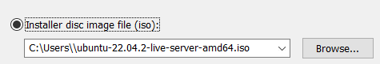

dejamos el nombre por defecto

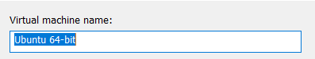

tamaño por defeccto(20GB)

lo siguiente es la informacion de nuestra maquina viertual, y damos click en finish

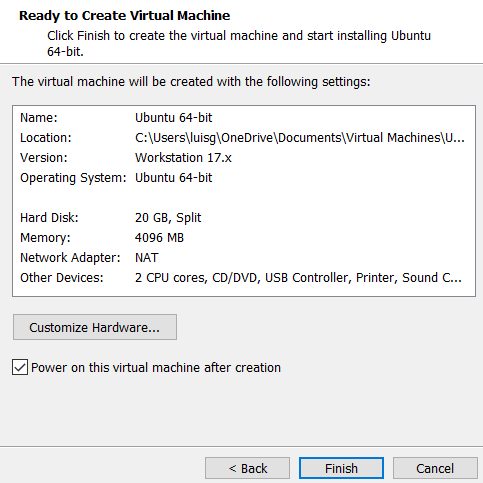

La máquina virtual se iniciará desde la imagen ISO que seleccionó y podrá comenzar la instalación del sistema operativo.

### configuración de la maquina virtual

seleccionamos idioma ingles

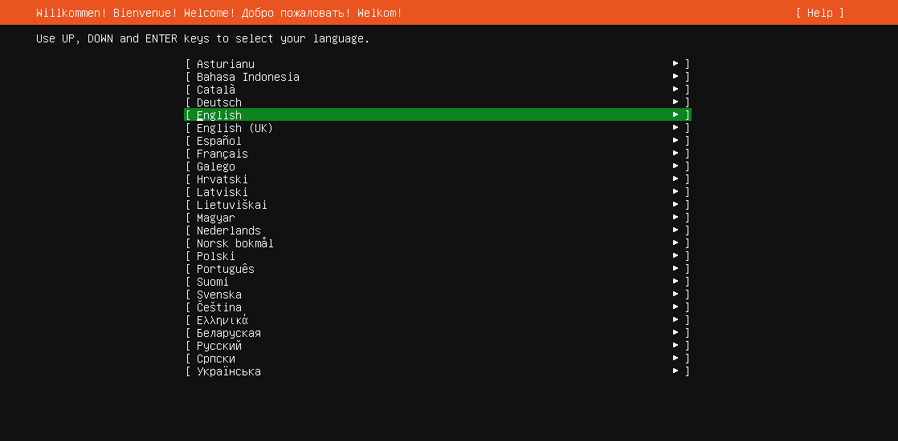

click en continue without updating

click en done, dejaremos el teclado en ingles

verificamos que solamente este marcado Ubuntu server

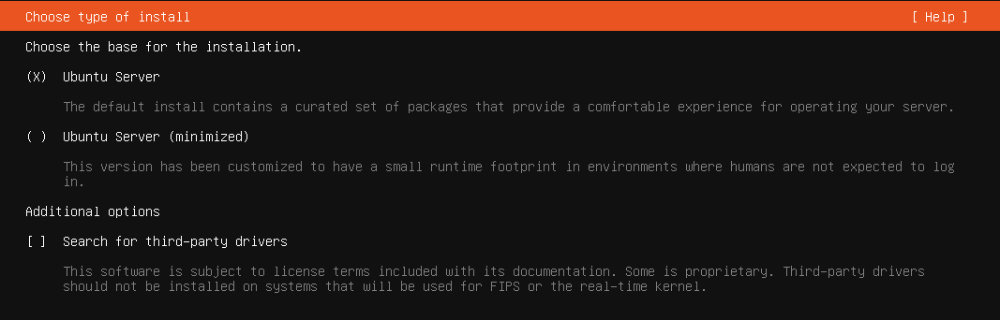

anotamos la ip que s enos muestra, la usaremos mas adelante 

dejamos en blanco el proxy addres

cambiamos SV por CO, esto debido a que utilizareemos el servidor de colombia

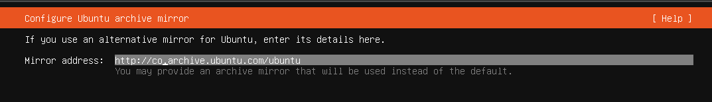

nos aseguramos que esten marcadas estas opciones

click en done

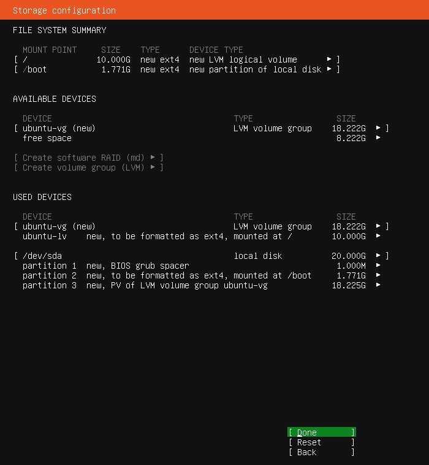

click en continue

Para fines prácticos del laboratorio, completamos el formulario con los siguientes datos:

    Name: uca
    server name: uca
    username: laboredes03
    password: 12345

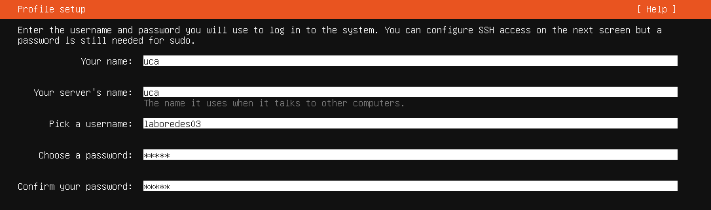
 
 dejamos marcado skip for now
 
 
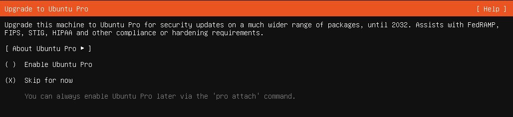

instalamos ssh, no se utilizara pero de ser necesario lo utilizaremos

maarcamos unicamente la opcion de docker, con un espacio 

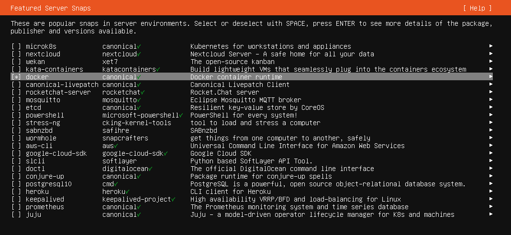

comenzara la actualizacion, tomara unos minutos, pero solo daremos click cuando nos diga reboot now

si al iniciar la maquina mueestra este error, solo debemos de dar enter y acceder con uestras credenciales

# Instalación de Docker
### Actualizar base de datos de paquetes

    sudo apt update

A continuación, instale algunos paquetes de requisitos previos que permitan a `apt` usar paquetes a través de HTTPS:

    sudo apt install apt-transport-https ca-certificates curl software-properties-common

Luego, añada la clave de GPG para el repositorio oficial de Docker en su sistema:

    curl -fsSL https://download.docker.com/linux/ubuntu/gpg | sudo apt-key add -

Agregue el repositorio de Docker a las fuentes de APT:

    sudo add-apt-repository "deb [arch=amd64] https://download.docker.com/linux/ubuntu focal stable"

A continuación, actualice el paquete de base de datos con los paquetes de Docker del repositorio recién agregado:

    sudo apt update

Asegúrese de estar a punto de realizar la instalación desde el repositorio de Docker en lugar del repositorio predeterminado de Ubuntu:

    apt-cache policy docker-ce

apt-cache policy docker-ce

    sudo apt install docker-ce

Con esto, Docker quedará instalado, el demonio se iniciará y el proceso se habilitará para ejecutarse en el inicio. Compruebe que funcione:

    sudo systemctl status docker

### Instalar Docker Compose

El siguiente comando descargará la `1.29.2`versión y guardará el archivo ejecutable en `/usr/local/bin/docker-compose`, lo que hará que este software sea accesible globalmente como `docker-compose`:

    sudo curl -L "https://github.com/docker/compose/releases/download/1.29.2/docker-compose-$(uname -s)-$(uname -m)" -o /usr/local/bin/docker-compose

A continuación, establezca los permisos correctos para que el `docker-compose`comando sea ejecutable:

    sudo chmod +x /usr/local/bin/docker-compose

Para verificar que la instalación fue exitosa, puede ejecutar:

    docker-compose --version

### Reiniciar la máquina
Para que algunos de los servicios que acabamos de instalar funcionen
correctamente, debemos reiniciar nuestra máquina virtual.
luego de este paso, debremos iniciar sesion denuevo en nuestra maquina virtual
utiliza el siguiente comando:

     sudo reboot now

### Verificar la versión de Docker

    docker version

### Clonar el repositorio de Github
Creamos una carpeta y ahi clonamos el repositorio 

    mkdir repo
    cd repo

Debemos clonar el siguiente repositorio:
https://github.com/00091318/docker_guiaLB-main.git

    git clone https://github.com/00091318/docker_guiaLB-main.git

ejecutamos los siguentes comandos:

    cd docker_guiaLB-main/
    cd Laboratorio3
    cd src
    nano App.js

el codigo debera verse de la siguiente manera:

    import './App.css';
    import { useState, useEffect } from "react";
    import Axios from "axios";
    
    ///////////////////////(utilizar IP de la maquina, esa es solo ejemplo, mantener el puerto 3000)
    const API = "http://192.168.134.128:3000";
    ///////////////////////(utilizar IP de la maquina, esa es solo ejemplo, mantener el puerto 3000)
    
    function App() {
      const [name, setName] = useState("");
      const [listOfInfo, setListOfInfo] = useState([]);
    
      const addInfo = async() => {
        try{
          console.log("Llego");
          const data = await Axios.post(API + "/api/infos", {
            name: name
          }).then((response) => {
            setListOfInfo([
              ...listOfInfo,
              { _id: response.data._id, name: name },
            ]);
          });
          window.location.reload();
        }catch(e){
          console.log(e);
        }
      };
    
      const updateInfo = (id) => {
        const name = prompt("Enter nuevo nombre: ");
    
        Axios.put(`${API}/api/infos/${id}`, {
          name: name,
        }).then((response) => {
          setListOfInfo([
            ...listOfInfo,
            { _id: response.data._id, name: name },
          ]);
        });
        window.location.reload();
      };
    
      const deleteInfo = (id) => {
        Axios.delete(`${API}/api/infos/${id}`).then(
          () => {
            setListOfInfo(
              listOfInfo.filter((val) => {
                return val._id != id;
              })
            );
          }
        );
      };
    
      useEffect(() => {
        Axios.get(API + "/api/infos")
          .then((response) => {
            setListOfInfo(response.data);
          })
          .catch(() => {
            console.log("ERR");
          });
      }, []);
regresamos al directorio principal ejecutando el comando **cd**

ejecutamos los siguientes comandos:

    cd ..
    cd ..
    cd mongodb/
    ls
    sudo docker compose up -d
    sudo docker  ps -a
    cd ..

el archivo docker compose.yml contiene los siguientes elementos:

es importante recalcar que tenemos 3 contenedores, en cada uno se debera hacer el mismo proceso (mongdb, Laboratorio3-Api y Laboratorio3 ), asi que realizamos los siguientes comandos:

    debemos de estar en el directorio principal, es decir docker_guiaLB/
    
    cd ..
    cd Laboratorio3-Api/
    ls
    cp docker-compose.dev.yml docker-compose.yml
    sudo docker compose up -d
    sudo docker  ps -a
    cd ..
    
    debemos de estar en el directorio principal, es decir docker_guiaLB/
    
    cd Laboratorio3/
    ls
    cp docker-compose.dev.yml docker-compose.yml
    sudo docker compose up -d
    sudo docker  ps -a
    cd ..

veremos como los contenedores comienzan a levantarse uno por uno, al hacer sudo docker ps -a veremos nuestrso contenedores arriba

Mostrar las images creadas:

    sudo docker images

Mostrar los contenedores:

    sudo docker ps -a

Mostrar los volumes:

    sudo docker volume ls

Probar el sistema
Si logramos hacer todo correctamente, podremos ver el sistema corriendo sin mayor
problema.

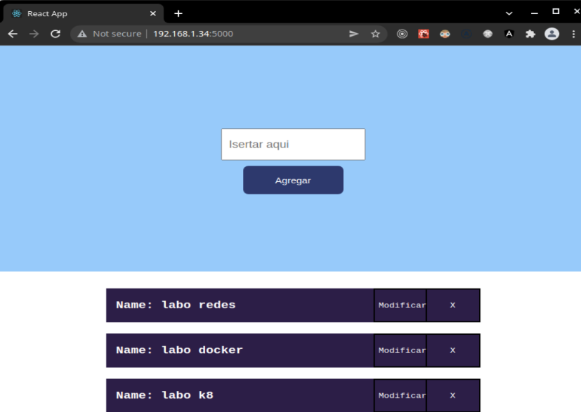

